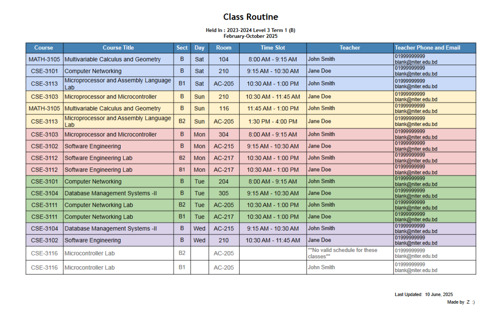

# Automated UCAM Class Routine to Google Sheets

This project provides an automated solution for scraping class schedules from the UCAM web portal and organizing them within a Google Spreadsheet.

## ✨ Final Output Preview

Here is a preview of the final, formatted routine sheet this project generates. It uses conditional formatting for better visual organization, and the data is automatically sorted by day and time.



[**Click here to get the demo output sheet**](https://docs.google.com/spreadsheets/d/1mE36dYY9u4rgwbJl9rq8LibBlB-VLd_K3Jli_Db3bxA/edit?usp=sharing)<br>


### Features ✨
* Automates login to the UCAM portal to fetch schedule data.

* Supports combining schedules from two user accounts, ideal for consolidating lab sections.
* Enriches the schedule data with teacher contact information from a local configuration file.
* Allows the user to choose between **Firefox** or **Chrome** for web scraping.
* Uploads the raw data to a 'backend' sheet in a specified Google Spreadsheet.
* Triggers a Google Apps Script to process the raw data, which:
    * Parses and formats class times into a readable 12-hour format.
    * Sorts the complete schedule chronologically by day and time.
    * Populates a clean, formatted routine into a 'NewMain' sheet.
    * Adds a "Last Updated" timestamp for clear reference.

---
## Prerequisites 🛠️
Before you begin, ensure the following software is installed on your system:

* **Python 3.7+**
* **Pip**
* A supported web browser: **Mozilla Firefox** or **Google Chrome**.
* The corresponding **WebDriver** for your chosen browser. This is a necessary component for automation.
    * **GeckoDriver** for Firefox
    * **ChromeDriver** for Chrome
* A **Google Account** with access to Google Drive and Google Cloud Platform.

---
## Project Files Overview 📂
A brief overview of the key files and directories:

```
project_root/
|-- routine_scrapper.py         # The script that fetches data from UCAM.
|-- gsheet_formatter.py         # The script for Google Sheets integration.
|
|-- configs_to_edit/            # ❗ USER CONFIGURATION REQUIRED HERE.
|   |-- ucam_login_credentials.json.example
|   |-- teacher_contact_details.json.example
|
|-- google_cloud_keys/          # ❗ GOOGLE API KEYS ARE STORED HERE.
|   |-- service_account_key.json.example
|   |-- oauth_client_secret.json.example
|
|-- output_of_fetched_routine/  # Default location for the generated schedule data.
|-- webdriver/                  # Directory for WebDriver executables.
|
|-- requirements.txt            # Lists required Python packages.
|-- token.pickle                # Automatically created to store Google authentication.
|-- README.md                   # This instruction file.
```

---
## Setup Guide ⚙️

Follow these steps carefully to configure and run the project.

### Step 1: Get the Project Files
Download or clone all project files to a local directory on your computer.

### Step 2: Install Required Python Packages
Using a virtual environment is recommended to keep project dependencies isolated.

* **Create and activate a virtual environment (optional but recommended):**
    ```bash
    python3 -m venv venv
    ```

    ```bash
    # On macOS/Linux:
    source venv/bin/activate

    # On Windows:
    venv\Scripts\activate
    ```
* **Install packages from the requirements file:**
    ```bash
    pip install -r requirements.txt
    ```

### Step 3: Set Up Your Browser Driver
The script requires a WebDriver to control the browser programmatically.

* **First, select your browser in the script:**
    Open the `routine_scrapper.py` file and edit the `PREFERRED_BROWSER` variable.

    ```python
    PREFERRED_BROWSER = "firefox"  # Or change to "chrome"
    ```
* **Next, download the corresponding driver:**
    * **For Firefox:** Download GeckoDriver from [Mozilla's GitHub page](https://github.com/mozilla/geckodriver/releases).
    * **For Chrome:** Download ChromeDriver from the [Chrome for Testing page](https://googlechromelabs.github.io/chrome-for-testing/). Ensure the driver version matches your installed Chrome version.
* **Finally, place the driver executable:**
    1.  Move the downloaded `geckodriver` or `chromedriver` file into the `webdriver/` folder.
    2.  **On macOS/Linux,** make the driver executable by running one of these commands in your terminal:

        ```bash
        chmod +x webdriver/geckodriver
        ``` 
        or 
        ```bash
        chmod +x webdriver/chromedriver
        ```

### Step 4: Configure UCAM Details
Provide your user-specific information for the script to use.

* **Login Credentials:**
    1.  In the `configs_to_edit/` folder, copy `ucam_login_credentials.json.example.txt` and rename it to `ucam_login_credentials.json`.
    2.  Open the new file and provide your UCAM Student ID and password.
* **Teacher Information:**
    1.  In the same folder, copy `teacher_contact_details.json.example.txt` and rename it to `teacher_contact_details.json`.
    2.  Open it and add your teachers' details, using their UCAM portal initials as the primary key.

### Step 5: Configure Google API Access
This step generates API keys, which allow the scripts to securely interact with your Google account services.

* **Enable Google Services:**
    1.  Navigate to the [Google Cloud Console](https://console.cloud.google.com/) and sign in.
    2.  Create a new project or select an existing one.
    3.  In the project's "API Library," search for and **enable** these three APIs:
        * **Google Sheets API**
        * **Google Apps Script API**
        * **Google Drive API**
* **Get Your First Key (Service Account):** This key allows the script to directly edit your Google Sheet.
    1.  In the Google Cloud Console, go to "IAM & Admin" > "Service Accounts" and create a new service account.
    2.  Assign it the "Editor" role for this project.
    3.  After creating the account, generate a new JSON key for it from its "KEYS" tab.
    4.  A JSON file will be downloaded. *Rename* it to `service_account_key.json` and place it in the `google_cloud_keys/` folder.
    5.  **Important:** Open the key file, copy the `client_email` address, and share your target Google Sheet with this email as an "Editor."
* **Get Your Second Key (OAuth Client ID):** This key allows the script to request your permission to run the Google Apps Script.
    1.  In the Google Cloud Console, go to "APIs & Services" > "Credentials."
    2.  Create a new "OAuth client ID" and select "Desktop app" as the application type.
    3.  After creation, download the client ID's JSON file.
    4.  **Rename the downloaded file to `oauth_client_secret.json`** and place it in the `google_cloud_keys/` folder.

### Step 6: Final Script Configuration
Review the Python scripts for final adjustments.

* **Edit `gsheet_formatter.py`:**
    * `SPREADSHEET_NAME`: Set this to the **exact name** of your Google Spreadsheet.
    * `TARGET_SHEET_NAME`: Ensure this is set to `'backend'`. This is the designated sheet for raw data.
    * `APP_SCRIPT_ID`: This will be set in the following step.
* **Set up the Google Apps Script:**
    1.  **In your Google Sheet, create two tabs (sheets):** one named **`backend`** and another named **`NewMain`**.
    2.  **Add the script:** From your sheet, go to "Extensions" > "Apps Script" to open the editor.
    3.  Name the script project (e.g., "Routine Sorter").
    4.  Delete any boilerplate code and **paste in the full Apps Script code** provided in the expandable section below.
        <details>
        <summary>Click to view the full Apps Script code</summary>

        ```javascript
        // Google Apps Script: Code.gs

        const SIGNATURE = "Made by Z  :)";

        // This function will be called by your Python script
        function triggerSortFromPython() {
        // Call the main sorting function.
        // We pass 'null' for the event object 'e' since this isn't a manual edit.
        sortBackendData(null);
        }

        function sortBackendData(e) {
        // Check if the edited sheet is the 'backend' sheet (only relevant if script is also triggered by onEdit)
        // If called by Python, 'e' will be null, so this check is bypassed.
        if (e && e.source.getActiveSheet().getName() !== "backend") {
            return; // Exit if the edit was not on the backend sheet (for onEdit trigger)
        }

        const ss = SpreadsheetApp.getActiveSpreadsheet();
        const backendSheet = ss.getSheetByName("backend");
        const targetSheet = ss.getSheetByName("NewMain"); // This is where sorted data goes
        const targetStartCell = "B4"; // Starting cell in "NewMain" for the sorted data
        // const newMainSheet = ss.getSheetByName("NewMain"); // Already defined as targetSheet

        // Check if essential sheets exist
        if (!backendSheet) {
            // SpreadsheetApp.getUi().alert("Error", "Sheet 'backend' not found!", SpreadsheetApp.getUi().ButtonSet.OK); // UI alert won't show from Python
            console.error("Apps Script Error: Sheet 'backend' not found!");
            return;
        }
        if (!targetSheet) {
            // SpreadsheetApp.getUi().alert("Error", "Sheet 'NewMain' not found! Please create it.", SpreadsheetApp.getUi().ButtonSet.OK);
            console.error("Apps Script Error: Sheet 'NewMain' not found! Please create it.");
            return;
        }

        const lastRow = backendSheet.getLastRow();
        // If backendSheet has only a header (row 1) or is empty (lastRow < 2)
        if (lastRow < 2) {
            const startRowOutput = targetSheet.getRange(targetStartCell).getRow();
            const startColOutput = targetSheet.getRange(targetStartCell).getColumn();
            // Clear previous content in the target area (8 columns wide, adjust if your data has different width)
            targetSheet.getRange(startRowOutput, startColOutput, targetSheet.getMaxRows() - startRowOutput + 1, 8).clearContent();
            targetSheet.getRange(targetStartCell).setValue("No data found in 'backend' sheet to sort (only header or empty).");

            // Update timestamp and signature even if no data
            // Ensure this timezone is correct for your desired output, or use Session.getScriptTimeZone()
            const currentDate = Utilities.formatDate(new Date(), "GMT+6", "d MMMM, yyyy HH:mm");
            targetSheet.getRange("I24").setValue("Last Updated: " + currentDate).setHorizontalAlignment("left");
            targetSheet.getRange("I25").setValue(SIGNATURE).setHorizontalAlignment("right"); // Use the constant
            console.log("Apps Script: No data in 'backend' to process. Timestamp updated.");
            return;
        }

        // Get data from A2:H (assuming 8 columns of data) to the last row with content
        const data = backendSheet.getRange("A2:H" + lastRow).getValues();

        const dayOrder = {
            "SAT": 1,
            "SUN": 2,
            "MON": 3,
            "TUE": 4,
            "WED": 5,
            "THU": 6,
            "FRI": 7
        };

        // --- Helper function to parse and format time strings ---
        function parseAndFormatTime(timeStr) {
            if (!timeStr || typeof timeStr !== 'string' || timeStr.trim() === '') {
            return {
                formatted: "",
                sortable: 99999
            }; // High sortable for empty/invalid
            }

            try {
            const parts = timeStr.trim().split(/\s*-\s*/);
            let startTime = parts[0];
            let endTime = parts[1] || "";

            function getSortableAndFormatted(tStr) {
                if (!tStr || tStr.trim() === '') return {
                formatted: "",
                sortable: 99999
                };

                let hour = 0;
                let minute = 0;
                let explicitPeriod = '';

                const match = tStr.match(/^(\d{1,2}):(\d{1,2})(?:\s*(AM|PM))?/i);
                if (match) {
                hour = parseInt(match[1]);
                minute = parseInt(match[2]);
                explicitPeriod = match[3] ? match[3].toUpperCase() : '';
                } else {
                console.warn("Time string does not match expected pattern: " + tStr + ". Using original.");
                return {
                    formatted: tStr,
                    sortable: 99998
                }; // Different high sortable for pattern mismatch
                }

                let sortableHour = hour;
                let finalDisplayPeriod = '';

                if (explicitPeriod === 'PM') {
                if (sortableHour < 12) {
                    sortableHour += 12;
                } // 1 PM -> 13
                finalDisplayPeriod = 'PM';
                } else if (explicitPeriod === 'AM') {
                if (sortableHour === 12) {
                    sortableHour = 0;
                } // 12 AM -> 0 (midnight)
                finalDisplayPeriod = 'AM';
                } else { // No explicit AM/PM, infer based on typical class hours
                if (hour >= 7 && hour <= 11) { // Typically AM hours
                    finalDisplayPeriod = 'AM';
                } else if (hour === 12 || (hour >= 1 && hour <= 5)) { // Typically PM hours
                    finalDisplayPeriod = 'PM';
                    if (hour >= 1 && hour <= 5) {
                    sortableHour += 12;
                    } // 1 PM -> 13 etc. (12 PM is already 12)
                } else { // Ambiguous or outside typical routine hours
                    finalDisplayPeriod = (hour >= 6 && hour < 7) ? 'AM' : 'PM'; // Default assumption for ambiguous like 6:xx
                    console.warn("Ambiguous time (no AM/PM, outside typical 7-11 AM or 12-5 PM): " + tStr + ". Assuming " + finalDisplayPeriod);
                }
                }

                const sortableValue = sortableHour * 60 + minute;
                let displayHour = sortableHour;
                if (displayHour === 0) {
                displayHour = 12;
                } // 00:XX -> 12:XX AM
                else if (displayHour > 12) {
                displayHour -= 12;
                } // 13:XX -> 1:XX PM

                const formattedDisplay = `${displayHour}:${String(minute).padStart(2, '0')} ${finalDisplayPeriod}`;
                return {
                formatted: formattedDisplay,
                sortable: sortableValue
                };
            }

            const parsedStart = getSortableAndFormatted(startTime);
            const parsedEnd = getSortableAndFormatted(endTime);

            let formattedTimeSlot = parsedStart.formatted;
            // Only append end time if it's valid and different from start time
            if (parsedEnd.formatted && parsedEnd.sortable < 90000 && parsedEnd.sortable > parsedStart.sortable) {
                formattedTimeSlot += ` - ${parsedEnd.formatted}`;
            } else if (parsedEnd.formatted && parsedEnd.sortable < 90000 && !endTime.includes("-")) {
                // If only one time was provided (no hyphen), use it.
                // This case might need refinement based on how single times are expected.
            }

            return {
                formatted: formattedTimeSlot,
                sortable: parsedStart.sortable
            };

            } catch (e) {
            console.error("Error parsing time slot string '" + timeStr + "':", e);
            return {
                formatted: timeStr,
                sortable: 99999
            }; // Fallback
            }
        }
        // --- End of helper function ---

        const processedData = data.map(row => {
            const day = row[3]; // Column D (Day - 0-indexed, so 3)
            const timeSlotRaw = row[5]; // Column F (Time Slot - 0-indexed, so 5)

            let sortableDay = 998; // Default for empty/unrecognized day
            if (day && typeof day === 'string' && day.trim() !== '') {
            sortableDay = dayOrder[day.trim().toUpperCase()] || 999; // Use 999 for unrecognized days to sort them last
            }

            const {
            formatted: formattedTimeSlot,
            sortable: sortableTime
            } = parseAndFormatTime(timeSlotRaw);

            const newRow = [...row]; // Create a mutable copy of the row
            newRow[5] = formattedTimeSlot; // Update the Time Slot column in the copy

            return [...newRow, sortableDay, sortableTime]; // Append sort keys
        });

        // Sort by day, then by time
        processedData.sort((a, b) => {
            const dayA = a[a.length - 2]; // sortableDay
            const dayB = b[b.length - 2]; // sortableDay
            const timeA = a[a.length - 1]; // sortableTime
            const timeB = b[b.length - 1]; // sortableTime

            if (dayA !== dayB) {
            return dayA - dayB;
            }
            return timeA - timeB;
        });

        // Clear previous content in target sheet and write new sorted data
        const startRowOutput = targetSheet.getRange(targetStartCell).getRow();
        const startColOutput = targetSheet.getRange(targetStartCell).getColumn();
        // Clear a sufficiently large area, assuming 8 columns of data from original source
        targetSheet.getRange(startRowOutput, startColOutput, Math.max(1, targetSheet.getLastRow() - startRowOutput + 1), 8).clearContent();


        if (processedData.length > 0) {
            // Write data, excluding the appended sort keys (original 8 columns)
            targetSheet.getRange(startRowOutput, startColOutput, processedData.length, 8) // Write 8 columns
            .setValues(processedData.map(row => row.slice(0, 8))); // Slice off the two sort keys, take original 8 columns
        } else {
            targetSheet.getRange(targetStartCell).setValue("No valid data processed from 'backend' sheet.");
        }

        // Update timestamp and signature in "NewMain" sheet
        const currentDate = Utilities.formatDate(new Date(), "GMT+6", "d MMMM, yyyy HH:mm"); // Ensure timezone is correct
        targetSheet.getRange("I24").setValue("Last Updated: " + currentDate).setHorizontalAlignment("left");
        targetSheet.getRange("I25").setValue(SIGNATURE).setHorizontalAlignment("right"); // Use the constant

        console.log("Apps Script: Routine processing complete. Data sorted and written to 'NewMain'.");
        }
        ```

        </details>

    5.  **Deploy the script:** Click "Deploy" > "New deployment," choose type "API Executable," and follow the prompts to publish it.
    6.  **Copy the Script ID** provided upon successful deployment.
    7.  **Paste this ID** into the `APP_SCRIPT_ID` variable in `gsheet_formatter.py`.

---
## How to Run the Scripts 🚀

1.  **Open your terminal** (or Command Prompt) and navigate to the project directory.
2.  **Run the scraper script** to fetch the routine:

    ```bash
    python3 routine_scrapper.py
    ```
3.  **Run the formatter script** to update Google Sheets:
    ```bash
    python3 gsheet_formatter.py
    ```
    * **On the first run,** a browser window will open for Google authentication. This is expected and necessary for the OAuth flow. A `token.pickle` file will be created to save this authorization for future runs.

---
## Check Your Work ✅
* The `backend` sheet in your Google Spreadsheet should contain the raw, unsorted data.
* The `NewMain` sheet should display the final, sorted, and formatted class schedule, including the "Last Updated" timestamp.

---
## Troubleshooting Tips 🔍
* **File Not Found:** Ensure you have correctly copied and renamed the `.example.txt` files to `.json` in the `configs_to_edit/` directory.
* **Browser/Driver Errors:** This typically indicates that the WebDriver is missing from the `webdriver/` directory or its version is incompatible with your browser.
* **Google API Errors:** Verify that all three APIs are enabled in the Google Cloud Console and that you have shared your Google Sheet with the service account's `client_email` as an "Editor."
* **Data Not Appearing in `NewMain`:** Check the "Executions" log in your Apps Script project for errors. The most common cause is a mismatch or typo in sheet names (e.g., `backend`, `NewMain`) between your spreadsheet and the Apps Script code.
