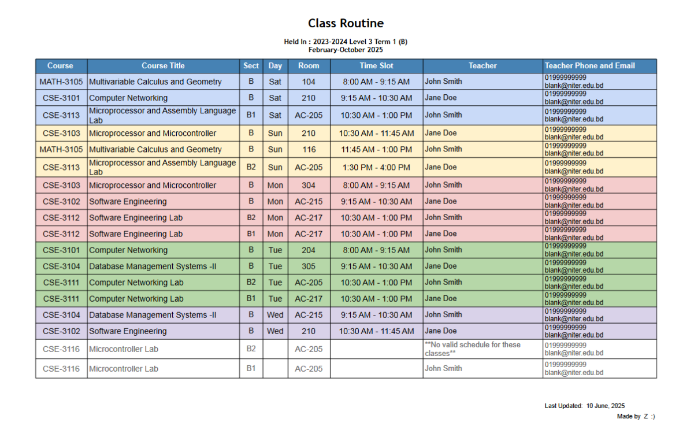

# Automated UCAM Class Routine to Google Sheets

An automated solution for scraping class schedules from the UCAM web portal and synchronizing them with a Google Spreadsheet.

**New here?** Follow the step-by-step bring-up guide in [**SETUP.md**](SETUP.md) — it covers Google Cloud setup, configuration, first run, and automation.

## Final Output Preview

The following image demonstrates the final, formatted routine sheet. It features conditional formatting and chronological sorting by day and time.



[**Demo Output Spreadsheet**](https://docs.google.com/spreadsheets/d/1mE36dYY9u4rgwbJl9rq8LibBlB-VLd_K3Jli_Db3bxA/edit?usp=sharing)

### Key Features
* **Automated Extraction**: Authenticates with the UCAM portal to retrieve schedule data.
* **Multi-User Consolidation**: Supports merging schedules from two accounts (e.g., for lab section synchronization).
* **Data Enrichment**: Integrates teacher contact details from local configuration files.
* **Flexible Browser Support**: Compatible with both Firefox and Google Chrome.
* **Sheets Integration**: Uploads raw data and triggers Google Apps Script for post-processing.
* **Advanced Processing**: 
    * Normalizes time formats to 12-hour display.
    * Chronological sorting by day and time.
    * Generates a "Last Updated" timestamp.

---

## Prerequisites
Ensure the following software is installed on your system:

* **Python 3.10+**
* **pip** (Python package manager)
* **Google Chrome** or **Chromium** (Recommended; utilized with `undetected-chromedriver` for reliability).
* **Xvfb** (Required for headless Linux environments).
* **Google Account** with enabled access to Google Drive and Google Cloud Platform.

---

## Project Structure
```text
project_root/
├── routine_scrapper.py         # Primary scraping logic for UCAM portal
├── gsheet_formatter.py         # Google Sheets API integration
├── config.py                   # Central runtime configuration
├── SETUP.md                    # Step-by-step bring-up guide
├── .env.example                # Environment variable overrides template
├── apps_script/                # Google Apps Script source
│   └── Code.gs                 # Paste into Extensions > Apps Script
├── tests/                      # Unit test suite (pytest)
├── configs_to_edit/            # User configuration directory
│   ├── ucam_login_credentials.json.example.txt
│   └── teacher_contact_details.json.example.txt
├── google_cloud_keys/          # API credentials directory
│   ├── service_account_key.json.example.txt
│   └── oauth_client_secret.json.example.txt
├── scripts/                    # Local automation and helper scripts
│   ├── run_routine.sh          # Portable runner script
│   ├── setup.py                # Config scaffold + validation
│   ├── check_setup.py          # Online preflight check
│   ├── routine-automation.service.example
│   └── routine-automation.timer.example
├── output_of_fetched_routine/  # Local cache for scraped data
├── requirements.txt            # Project dependencies
├── token.pickle                # Cached Google API authentication token
└── README.md                   # Documentation
```

---

## Installation and Setup

### 1. Project Initialization
Clone the repository and navigate to the project root:

```bash
git clone https://github.com/zaheen4/routine-to-gsheet.git
cd routine-to-gsheet
```

### 2. Dependency Management
It is recommended to use a virtual environment for dependency isolation.

**Unix/macOS:**
```bash
python3 -m venv .venv && source .venv/bin/activate && pip install -r requirements.txt
```

**Windows:**
```powershell
python -m venv .venv; .\.venv\Scripts\activate; pip install -r requirements.txt
```

### 3. Browser and Runtime Configuration
Runtime settings are centralized in `config.py` and read from environment variables (optionally via a `.env` file). Copy `.env.example` to `.env` (or run `python scripts/setup.py` to scaffold all config files at once) and adjust if the defaults don't apply:
```bash
cp .env.example .env
```
```env
PREFERRED_BROWSER=chrome   # Options: "chrome", "firefox"
HEADLESS=false             # Set to true to run without a visible window
#CHROME_BINARY_PATH=/usr/bin/google-chrome-stable   # Pin a specific Chrome/Chromium binary
SPREADSHEET_NAME=CSE-03_B_ClassRoutine   # Exact name of your Google Spreadsheet
APP_SCRIPT_ID=your_script_id             # From the Apps Script deployment (section 6)
LOG_LEVEL=INFO             # Options: DEBUG, INFO, WARNING, ERROR
```

When using Chrome, the scraper auto-detects the browser binary (preferring `google-chrome-stable`) and downloads a chromedriver matching that binary's major version. Set `CHROME_BINARY_PATH` to force a specific binary (useful when both Google Chrome and Chromium are installed).

### 4. Configuration
Run `python scripts/setup.py` to copy the template files to their real names and validate them, or copy them by hand:
1. **UCAM Credentials**: Copy `configs_to_edit/ucam_login_credentials.json.example.txt` to `ucam_login_credentials.json` and provide your credentials.
2. **Teacher Details**: Copy `configs_to_edit/teacher_contact_details.json.example.txt` to `teacher_contact_details.json` and populate as needed.

### 5. Google Cloud Platform Setup
Enable the following APIs in the [Google Cloud Console](https://console.cloud.google.com/):
* Google Sheets API
* Google Apps Script API
* Google Drive API

#### Service Account Key
1. Create a Service Account under **IAM & Admin > Service Accounts**.
2. Assign the **Editor** role.
3. Generate a JSON key, rename it to `service_account_key.json`, and place it in `google_cloud_keys/`.
4. **Note**: Share your target Google Sheet with the `client_email` found in the JSON file.

#### OAuth Client ID
1. Create an **OAuth client ID** (Desktop app) under **APIs & Services > Credentials**.
2. Download the JSON, rename it to `oauth_client_secret.json`, and place it in `google_cloud_keys/`.

### 6. Script Configuration
Update the following variables in `config.py` (or override them in your `.env`):
* `SPREADSHEET_NAME`: The exact name of your Google Spreadsheet.
* `TARGET_SHEET_NAME`: Name of the worksheet that raw data is written to. Defaults to `'backend'`; only override if you also update the sheet names in the Apps Script below.
* `APP_SCRIPT_ID`: Obtained in the next step. Set it in `.env` (or directly in `config.py`).

#### Google Apps Script Deployment
1. Open your Google Sheet and navigate to **Extensions > Apps Script**.
2. Delete any stub code and paste the **entire** contents of [`apps_script/Code.gs`](apps_script/Code.gs).
3. **Deploy** as an **API Executable**.
4. Copy the **Script ID** into your `.env` as `APP_SCRIPT_ID` (or directly into `config.py`).

The formatter auto-creates both worksheets (`backend` and `NewMain`) if they don't already exist. A freshly created `NewMain` gets `SHEET_HEADERS` written to `B3:I3`; sorted data lands at `B4` as the Apps Script dictates.

---

## Usage

### Local Execution
1. **Scrape Routine**:
   ```bash
   python3 routine_scrapper.py
   ```
   *Note: On headless Linux, run via `xvfb-run --auto-servernum --server-args="-screen 0 1920x1080x24" python3 routine_scrapper.py`.*
2. **Update Sheets**:
   ```bash
   python3 gsheet_formatter.py
   ```
   *Note: On the first execution, an OAuth consent window will open in your browser to generate `token.pickle`.*

---

## Testing

Run the unit test suite (covers dashboard parsing, merge logic, browser workflow steps, and sheet-building helpers):

```bash
.venv/bin/python -m pytest tests/ -q
```

---

## Automation

### Local Automation (Linux Systemd)
For reliable weekly automation on your local machine that runs even if the computer was off at the scheduled time:

1. **Setup Config Directories**:
   ```bash
   mkdir -p ~/.config/systemd/user/
   ```
2. **Configure and Install Service**:
   Run this command from the project root to automatically generate the service with the correct paths:
   ```bash
   sed "s|/path/to/your/project|$(pwd)|g" scripts/routine-automation.service.example > ~/.config/systemd/user/routine-automation.service
   cp scripts/routine-automation.timer.example ~/.config/systemd/user/routine-automation.timer
   ```
3. **Activate**:
   ```bash
   systemctl --user daemon-reload
   systemctl --user enable --now routine-automation.timer
   ```

---

## Verification
- [ ] Check the `backend` sheet for raw data.
- [ ] Verify the `NewMain` sheet for sorted and formatted routine data.
- [ ] Confirm the "Last Updated" timestamp is current.

Before your first run, run the preflight check: `python scripts/check_setup.py`. It verifies the config files, that your spreadsheet opens with the service account, and that the Apps Script ID is configured.

---

## Troubleshooting
* **Permissions**: Ensure the target sheet is shared with the Service Account email.
* **API Limits**: Check the Google Cloud Console for quota errors if updates fail.
* **Selectors**: If UCAM updates their UI, the scraping logic in `routine_scrapper.py` may require adjustments.
